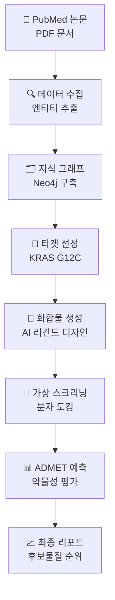

# SynapseRX 🔬💊

[](https://opensource.org/licenses/MIT)
[](https://www.python.org/)
[](https://neo4j.com/)

**AI 기반 신약 개발 자동화 파이프라인**

뇌의 신경세포 연결부인 '시냅스(Synapse)'처럼 흩어진 생물의학 정보를 연결하여 지식 그래프를 구축하고, 이를 통해 새로운 치료 후보물질을 발굴하는 AI 플랫폼입니다.

## ✨ 핵심 기능

### 🔍 생물학 데이터 수집 및 지식 그래프 구축
- **PubMed, PDF 자동 크롤링**: 최신 연구논문 및 데이터베이스에서 정보를 수집
- **LLM 기반 엔티티 추출**: 유전자, 질병, 화합물, 돌연변이 등의 관계를 자동 분석
- **Neo4j 지식 그래프**: 수집된 정보를 연결하여 구조화된 지식 베이스 구축

### 🧪 가상 스크리닝 및 최적화
- **화합물 라이브러리 생성**: AI를 활용한 신규 화합물 디자인
- **분자 도킹 시뮬레이션**: AutoDock Vina를 통한 단백질-리간드 결합 예측
- **ADMET 예측**: 약물 흡수, 분포, 대사, 배설, 독성 예측
- **Bayesian 최적화**: 실험 설계 자동화 및 효율적 최적화

### 📊 자동화된 분석 및 리포팅
- **종합 분석 리포트**: 도킹 점수, 결합 에너지, 약물성 예측을 통합 분석
- **시각화 대시보드**: 스크리닝 결과를 직관적으로 확인
- **실험 프로토콜 생성**: 최적화된 실험 설계 자동 생성


## 📁 프로젝트 구조

```
SynapseRX/
├── 🧠 bio_knowledge_miner/          # 생물학 데이터 수집 및 지식 그래프 구축
│   ├── data_collection/             # PubMed, PDF 데이터 수집
│   ├── knowledge_graph/             # Neo4j 그래프 구축 및 쿼리
│   ├── llm_services/                # LLM 기반 엔티티 추출
│   └── maintenance/                 # 데이터 정제 및 유지보수
├── 🤖 auto_hypothesis_agent/        # AI 기반 가설 생성 및 화합물 스크리닝
│   ├── pipelines/                   # 자동화 파이프라인
│   ├── simulation/                  # 도킹, ADMET 예측, 결합 에너지 계산
│   ├── ligand_generation/           # AI 화합물 생성
│   └── optimization/                # Bayesian 최적화
├── 📊 data/                         # 연구 데이터 및 결과물
├── 🔧 outputs/                      # 분석 결과 및 리포트
├── ⚙️ docker-compose.yml            # Neo4j 데이터베이스 설정
└── 📋 requirements.txt              # Python 의존성
```

## 🚀 전체 워크플로우



### 📋 상세 프로세스

| 단계 | 모듈 | 설명 |
|------|------|------|
| 1️⃣ | `bio_knowledge_miner` | 생물학 데이터 수집 → LLM 엔티티 추출 → Neo4j 지식 그래프 구축 |
| 2️⃣ | `auto_hypothesis_agent` | 타겟 단백질 선정 → AI 화합물 생성 → 가상 스크리닝 파이프라인 |
| 3️⃣ | 시뮬레이션 | 분자 도킹, 결합 에너지 계산, ADMET 예측 수행 |
| 4️⃣ | 분석 | 결과 통합 분석 및 최적화된 실험 프로토콜 생성 |

## 🛠️ 기술 스택

| 카테고리 | 기술 |
|----------|------|
| **프로그래밍 언어** | Python 3.10+ |
| **AI/ML** | PyTorch, LangChain, OpenAI GPT, Google Gemini |
| **생물정보학** | RDKit, OpenMM, MDAnalysis, BioPython |
| **데이터베이스** | Neo4j 5.18 (그래프 DB) |
| **데이터 처리** | Pandas, NumPy, SciPy |
| **인프라** | Docker, Conda, Git |

### 📦 주요 라이브러리
- 🔬 **RDKit**: 화학 정보학 및 분자 조작
- 🧬 **OpenMM**: 분자 역학 시뮬레이션
- 🤖 **LangChain**: LLM 애플리케이션 프레임워크
- 📊 **Neo4j**: 그래프 데이터베이스
- 🧪 **AutoDock Vina**: 분자 도킹 시뮬레이션

## ⚡ 빠른 시작 (Quick Start)

### 1️⃣ 환경 준비
```bash
# 프로젝트 클론
git clone <your-repository-url>
cd SynapseRX

# Conda 환경 생성 및 활성화
conda env create -f environment.yml
conda activate bio-info
```

### 2️⃣ 환경변수 설정
`.env` 파일을 생성하고 API 키를 설정하세요:
```env
# 필수: OpenAI API 키 (엔티티 추출용)
OPENAI_API_KEY=your_openai_api_key_here

# Neo4j 데이터베이스 설정
NEO4J_URI=bolt://localhost:7687
NEO4J_USER=neo4j
NEO4J_PASSWORD=password

# 선택사항: NCBI API 키 (PubMed 크롤링 가속화)
NCBI_API_KEY=your_ncbi_api_key_here
```

### 3️⃣ Neo4j 데이터베이스 실행
```bash
# Docker Compose로 Neo4j 실행
docker-compose up -d

# 브라우저에서 Neo4j 확인: http://localhost:7474
```

### 4️⃣ 의존성 설치
```bash
# Python 패키지 설치
pip install -r requirements.txt
```

## 🚀 사용 예시

### 🎯 간단한 실행 (KRAS G12C 타겟팅)
```bash
# 1. PDB ID 탐색
python find_pdb_ids.py --query "KRAS G12C"

# 2. 전체 신약 개발 파이프라인 실행
python run_drug_discovery.py --target_pdb_ids 5V90 6N2J --gene KRAS --num_candidates 50
```

### 📊 세부 단계별 실행

#### 1️⃣ 지식 그래프 구축
```bash
# 생물학 데이터 수집 및 그래프 구축
python -m bio_knowledge_miner

# 데이터 정제 및 최적화
python -m bio_knowledge_miner.maintenance.clean_gene_nodes
python -m bio_knowledge_miner.maintenance.fill_compound_structures --gene KRAS
```

#### 2️⃣ 화합물 스크리닝
```bash
# 화합물 라이브러리 생성 및 스크리닝
python run_compound_screening.py --gene KRAS --target_pdb 5V90

# 결과 분석 및 리포트 생성
python -m auto_hypothesis_agent.reports.reporter
```

### 🎮 주요 스크립트 설명

| 스크립트 | 설명 |
|----------|------|
| `run_drug_discovery.py` | **메인 파이프라인** - 지식 그래프 → 화합물 생성 → 스크리닝 → 리포트 |
| `run_compound_screening.py` | 화합물 가상 스크리닝 파이프라인 |
| `run_bio_knowledge_miner.py` | 지식 그래프 구축 파이프라인 |
| `find_pdb_ids.py` | 타겟 단백질 PDB ID 검색 |

## 📊 결과 확인

### 📁 출력 파일 구조
```
outputs/
├── reports/                    # 최종 분석 리포트 (Markdown)
│   ├── report_5V90_2025-01-15.md
│   └── report_6N2J_2025-01-15.md
├── docking/                    # 도킹 시뮬레이션 결과
│   ├── compound_001.pdbqt
│   └── compound_002.pdbqt
├── 5V90_out/                  # PDB별 상세 결과
│   ├── pockets/                # 결합 포켓 분석
│   └── *.pdb, *.pml            # 3D 구조 파일
└── md/                        # 분자 역학 시뮬레이션 결과
```

### 📈 리포트 분석 예시

| 순위 | 화합물 | 도킹 점수 | 결합 에너지 | ADMET 점수 |
|------|--------|-----------|-------------|------------|
| 🥇 | Irinotecan | -11.03 | -45.2 kcal/mol | 7.8/10 |
| 🥈 | Brimarafenib | -10.43 | -42.1 kcal/mol | 8.5/10 |
| 🥉 | RMC-9805 | -9.47 | -38.9 kcal/mol | 6.2/10 |

**주요 평가 지표:**
- **도킹 점수**: 단백질-리간드 결합 강도 (값이 낮을수록 강함)
- **결합 에너지**: MM/GBSA 계산을 통한 정밀한 결합 에너지
- **ADMET 점수**: 약물 흡수, 분포, 대사, 배설, 독성 예측

## 🤝 기여 방법

프로젝트 개선에 관심이 있으시다면:

1. **이슈 생성**: 버그 리포트나 기능 제안
2. **풀 리퀘스트**: 코드 개선 및 새로운 기능 추가
3. **문서화**: README 및 코드 문서 개선

### 📧 연락처
- **이메일**: [xodrnfl98@gmail.com]
- **깃허브 이슈**: 버그 리포트 및 기능 요청

## 📚 참고 자료

- [Neo4j 공식 문서](https://neo4j.com/docs/)
- [RDKit 문서](https://www.rdkit.org/docs/)
- [OpenMM 튜토리얼](https://openmm.org/)
- [LangChain 가이드](https://python.langchain.com/)

## 📄 라이선스

이 프로젝트는 [MIT 라이선스](LICENSE)를 따릅니다.

---

<div align="center">
  <p><strong>SynapseRX</strong> - AI 기반 신약 개발을 위한 오픈소스 플랫폼</p>
  <p>Made with ❤️ for accelerating drug discovery</p>
</div>