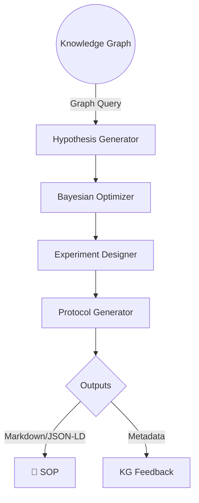

# Auto-Hypothesis Agent 📈🔬

**목표:** `bio_knowledge_miner`가 구축한 지식 그래프를 입력으로 받아,  
LLM + Bayesian Optimization을 사용해 **새로운 생물학 가설을 생성**하고 **실험 설계**를 자동으로 제안합니다.

> 핵심 키워드: Gemini 2.5 Flash-Lite, Ax 0.4, AlphaFold 3, Protocol-GPT, CRISPick-v3

---
## 🏗️ 아키텍처 개요



1. **Hypothesis Generator (`hypothesis_generator.py`)**  
   • 지식 그래프를 질의해 관련 노드·관계를 추출 →  
   • LLM-prompt 템플릿으로 *가설 목록* 생성
2. **Bayesian Optimizer (`optimization/bo_optimizer.py`)**  
   • Ax 0.4 사용 · 목표 함수는 *예상 정보 이득*  
   • 실험 파라미터(예: 화합물 농도, 세포주, 변이체)를 제안
3. **Experiment Designer (`experiment_designer.py`)**  
   • **단백질 구조/기능 예측**: AlphaFold 3 API  
   • **CRISPR 가이드 설계**: CRISPick-v3 연동  
   • 결과를 Pydantic 모델로 구조화
4. **Protocol Generator (`protocol_generator.py`)**  
   • Protocol-GPT 프롬프트 ↔ LLM 호출  
   • SOP ⟶ Markdown + JSON-LD
5. **KG Feedback (`kg_interface.py`)**  
   • 설계 결과를 Neo4j에 다시 업서트 → RAG-Loop 지원

---
## 📂 폴더 구조 (제안)
```
auto_hypothesis_agent/
├── __init__.py
├── config.py                # API 키, 기본 파라미터
├── kg_interface.py          # Neo4j ↔ 그래프 질의/업데이트
├── hypothesis_generator.py  # LLM 기반 가설 생성
├── optimization/
│   └── bo_optimizer.py      # Ax Bayesian Opt 래퍼
├── experiment_designer.py   # 구조 예측·CRISPR 설계 통합
├── protocol_generator.py    # SOP 출력
├── pipelines/
│   └── auto_hypothesis_pipeline.py  # CLI & 전체 파이프라인
└── examples/
    └── demo.ipynb
```

---
## 🔑 주요 클래스 & 함수

| 모듈 | 클래스/함수 | 설명 |
|------|-------------|-----|
| `kg_interface` | `GraphClient` | Cypher 실행, `to_networkx()` 등 헬퍼 제공 |
| `hypothesis_generator` | `HypothesisGenerator` | `generate(topic:str)->List[Hypothesis]` |
| `optimization/bo_optimizer` | `BOOptimizer` | `suggest(hypothesis)->ExperimentPlan` |
| `experiment_designer` | `ExperimentDesigner` | AlphaFold3, CRISPick 호출 → `design(plan)` |
| `protocol_generator` | `ProtocolGenerator` | `render(experiment)->SOP` (MD, JSON-LD) |
| `pipelines/auto_hypothesis_pipeline` | `run(topic:str)` | 전체 흐름 One-shot 실행 CLI |

각 데이터 모델은 **Pydantic** 스키마(`models.py`)로 표준화해 단계 간 객체 전달을 명확히 합니다.

---
## 🔄 첫 번째 모듈 연동 방법

1. `bio_knowledge_miner` 실행 결과물
    - `neo4j` 데이터베이스 (Bolt URI)
    - `data/result/knowledge_graph.json` (옵션)
2. `auto_hypothesis_agent.config` 예시
```toml
KG_BOLT_URI = "bolt://localhost:7687"
KG_USER = "neo4j"
KG_PASSWORD = "<pwd>"
OPENAI_API_KEY = "sk-..."
GEMINI_MODEL = "gemini-2.5-flash-lite"
ALPHAFOLD_ENDPOINT = "https://api.af3.example.com/predict"
```
3. 파이프라인 사용 예
```bash
python -m auto_hypothesis_agent.pipelines.auto_hypothesis_pipeline --topic "KRAS G12C inhibitor" --n_hypo 5
```

---
## ⌛ 향후 로드맵
- [ ] 멀티-objective BO (정보 이득 + 비용)
- [ ] Wet-lab 로봇 통제 API 연동
- [ ] Streamlit UI로 Hypothesis Dashboard 제공

---
## 📝 라이선스
MIT 