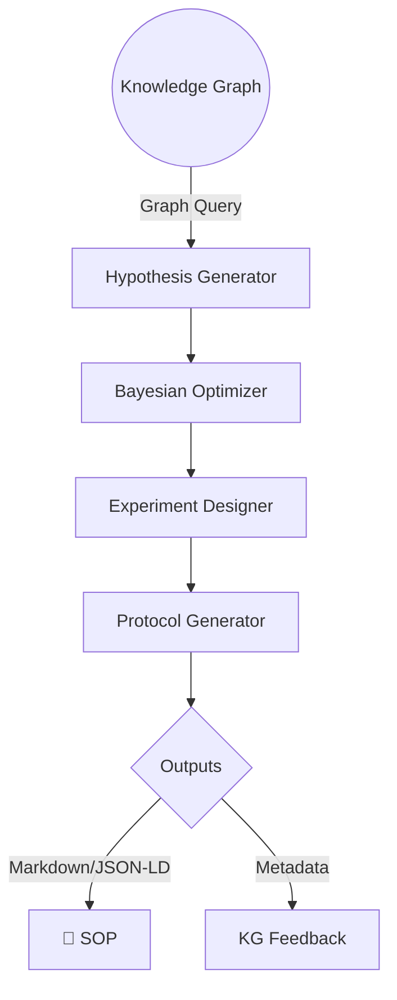

# Auto Hypothesis Agent

The `auto_hypothesis_agent` is an automated agent that establishes hypotheses based on the knowledge graph and external data, and validates them through computational simulations. This module contains the core of the project: the **compound virtual screening pipeline**.

## Virtual Screening Pipeline (`pipelines/compound_screen_pipeline.py`)

This pipeline automates the entire process of discovering and evaluating candidate inhibitors for a specific protein target.

### Pipeline Stages

1.  **Compound Library Preparation**
    -   Dynamically retrieves a list of compounds related to a specific target (e.g., KRAS) by querying the knowledge graph built by `bio_knowledge_miner`.
    -   Converts the retrieved compound information into a temporary SDF file to be used as input for the next stage.

2.  **Target Structure and Binding Pocket Preparation**
    -   Finds the PDB structure file for the target protein (e.g., KRAS G12C).
    -   Runs `fpocket` to detect binding pockets on the protein surface and calculates the 3D grid box coordinates for docking simulation.

3.  **ADMET Profile Prediction**
    -   Uses RDKit-based prediction models to calculate the basic drug-like properties (solubility, synthetic accessibility, potential toxicity, etc.) of each compound.

4.  **Molecular Docking**
    -   Docks the prepared compound library into the binding pocket of the target protein using `AutoDock Vina`.
    -   Calculates the binding energy (`docking_score`) for each compound to rank their binding affinities.

5.  **Binding Free Energy Calculation (MM/GBSA)**
    -   Performs MM/GBSA (Molecular Mechanics/Generalized Born Surface Area) calculations on the docked complex structures using `OpenMM`.
    -   This provides a more refined prediction of binding free energy (`delta_g`) to complement the docking scores.

6.  **Final Report Generation**
    -   Integrates all the data calculated in the above steps (docking scores, binding energies, ADMET properties) into a single CSV file.
    -   Generates the final screening report by ranking the candidate compounds based on their binding affinity.

## Key Simulation Modules (`simulation/`)

-   `admet_predictor.py`: ADMET property predictor using RDKit.
-   `docking.py`: Docking executor that controls AutoDock Vina.
-   `binding_energy.py`: MM/GBSA calculator using OpenMM and OpenMM-ForceFields.

# Auto-Hypothesis Agent 📈🔬

**Goal:** Takes the knowledge graph built by `bio_knowledge_miner` as input,  
and uses LLM + Bayesian Optimization to **generate new biological hypotheses** and automatically propose **experimental designs**.

> Keywords: Gemini 2.5 Flash-Lite, Ax 0.4, AlphaFold 3, Protocol-GPT, CRISPick-v3

---
## 🏗️ Architecture Overview


```mermaid
graph TD;
    K((Knowledge Graph)) -->|Graph Query| HG[Hypothesis Generator]
    HG --> BO[Bayesian Optimizer]
    BO --> ED[Experiment Designer]
    ED --> PG[Protocol Generator]
    PG --> P{Outputs}
    P -->|Markdown/JSON-LD| LabDocs[📄 SOP]
    P -->|Metadata| KGUpdate[KG Feedback]
```

1. **Hypothesis Generator (`hypothesis_generator.py`)**  
   • Queries the knowledge graph to extract relevant nodes/relationships →  
   • Generates a *list of hypotheses* using an LLM-prompt template.
2. **Bayesian Optimizer (`optimization/bo_optimizer.py`)**  
   • Uses Ax 0.4 · Objective function is *expected information gain*.  
   • Suggests experimental parameters (e.g., compound concentration, cell line, variant).
3. **Experiment Designer (`experiment_designer.py`)**  
   • **Protein Structure/Function Prediction**: AlphaFold 3 API  
   • **CRISPR Guide Design**: CRISPick-v3 integration  
   • Structures results into a Pydantic model.
4. **Protocol Generator (`protocol_generator.py`)**  
   • Protocol-GPT prompt ↔ LLM call  
   • SOP ⟶ Markdown + JSON-LD
5. **KG Feedback (`kg_interface.py`)**  
   • Upserts the design results back into Neo4j → supports a RAG-Loop.

---
## 📂 Proposed Folder Structure
```
auto_hypothesis_agent/
├── __init__.py
├── config.py                # API keys, default parameters
├── kg_interface.py          # Neo4j ↔ graph query/update
├── hypothesis_generator.py  # LLM-based hypothesis generation
├── optimization/
│   └── bo_optimizer.py      # Ax Bayesian Opt wrapper
├── experiment_designer.py   # Integrates structure prediction & CRISPR design
├── protocol_generator.py    # SOP output
├── pipelines/
│   └── auto_hypothesis_pipeline.py  # CLI & full pipeline
└── examples/
    └── demo.ipynb
```

---
## 🔑 Key Classes & Functions

| Module | Class/Function | Description |
|------|-------------|-----|
| `kg_interface` | `GraphClient` | Provides helpers for executing Cypher, `to_networkx()`, etc. |
| `hypothesis_generator` | `HypothesisGenerator` | `generate(topic:str)->List[Hypothesis]` |
| `optimization/bo_optimizer` | `BOOptimizer` | `suggest(hypothesis)->ExperimentPlan` |
| `experiment_designer` | `ExperimentDesigner` | Calls AlphaFold3, CRISPick → `design(plan)` |
| `protocol_generator` | `ProtocolGenerator` | `render(experiment)->SOP` (MD, JSON-LD) |
| `pipelines/auto_hypothesis_pipeline` | `run(topic:str)` | One-shot execution CLI for the entire flow |

Each data model is standardized with a **Pydantic** schema (`models.py`) to clarify object passing between stages.

---
## 🔄 How to Integrate with the First Module

1. `bio_knowledge_miner` execution outputs
    - `neo4j` database (Bolt URI)
    - `data/result/knowledge_graph.json` (optional)
2. `auto_hypothesis_agent.config` example
```toml
KG_BOLT_URI = "bolt://localhost:7687"
KG_USER = "neo4j"
KG_PASSWORD = "<pwd>"
OPENAI_API_KEY = "sk-..."
GEMINI_MODEL = "gemini-2.5-flash-lite"
ALPHAFOLD_ENDPOINT = "https://api.af3.example.com/predict"
```
3. Pipeline usage example
```bash
python -m auto_hypothesis_agent.pipelines.auto_hypothesis_pipeline --topic "KRAS G12C inhibitor" --n_hypo 5
```

---
## ⌛ Future Roadmap
- [ ] Multi-objective BO (information gain + cost)
- [ ] Integration with wet-lab robot control APIs
- [ ] Provide a Hypothesis Dashboard with a Streamlit UI

---
## 📝 License
MIT 